<p align="center">
  
</p>

<h1 align="center">PhaseWise</h1>

<p align="center">
  A full-stack project management platform designed for academic teams to organize projects into phases, manage tasks, and collaborate in real-time.
</p>

🔗 **Live Demo:** [https://phase-wise-seven.vercel.app](https://phase-wise-seven.vercel.app)

---

## 🖼️ Screenshots

> Quick visual overview of the application

### Authentication

<details open>
<summary><strong>Login</strong></summary>
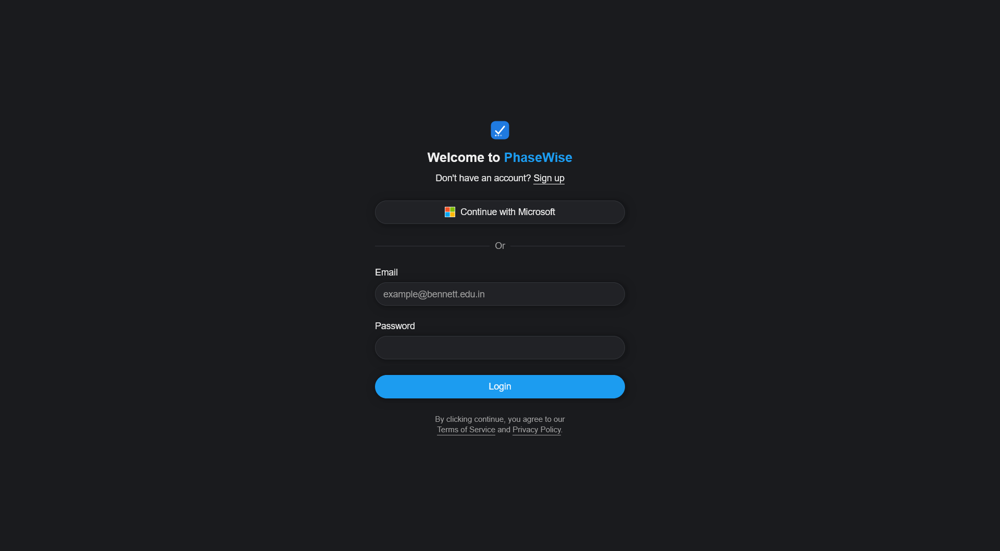
</details>

<details open>
<summary><strong>Signup</strong></summary>
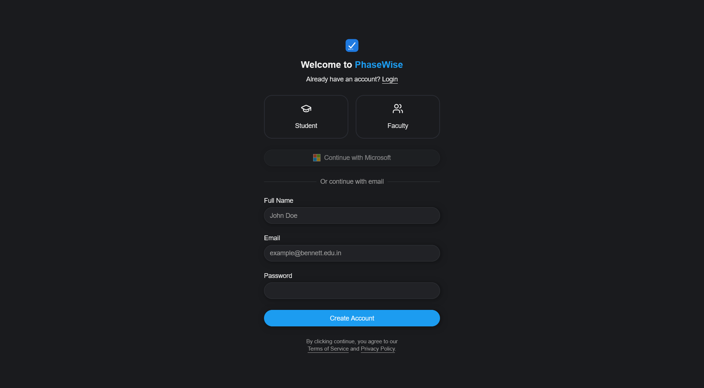
</details>

### Projects

<details open>
<summary><strong>Projects Overview</strong></summary>
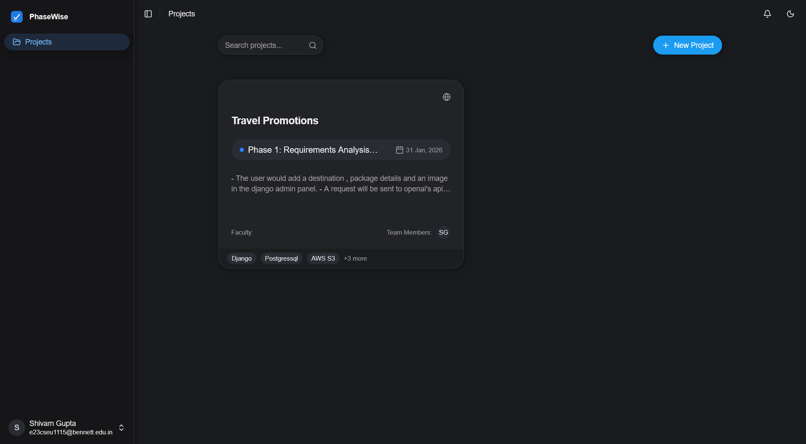
</details>

<details open>
<summary><strong>Create Project (Step 1)</strong></summary>
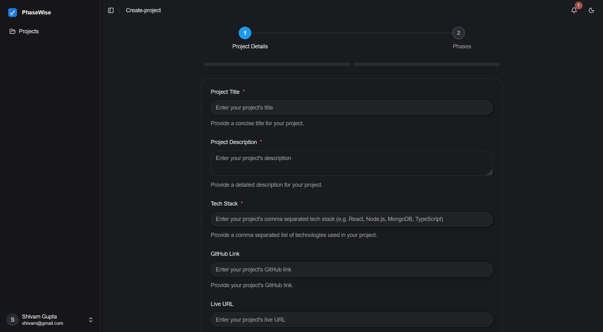
</details>

<details open>
<summary><strong>Create Project (Step 2)</strong></summary>
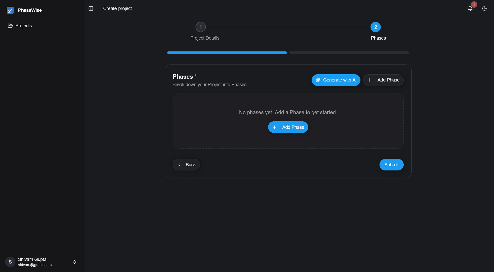
</details>

### Phases & Tasks

<details open>
<summary><strong>Phases</strong></summary>
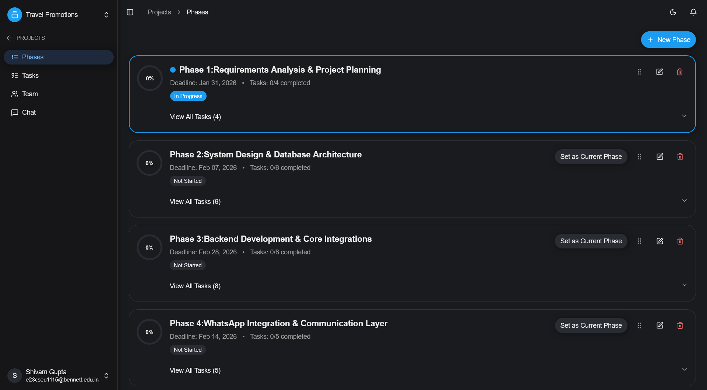
</details>

<details open>
<summary><strong>Tasks (Table View)</strong></summary>
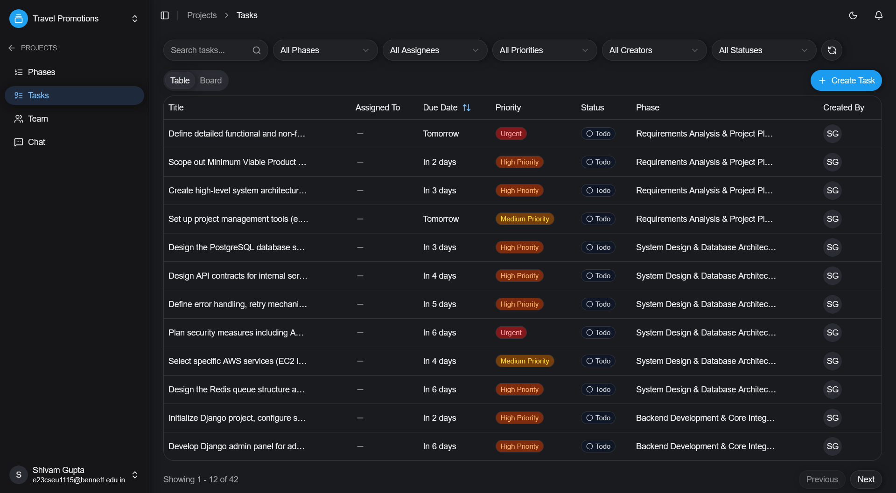
</details>

<details open>
<summary><strong>Tasks (Kanban Board)</strong></summary>
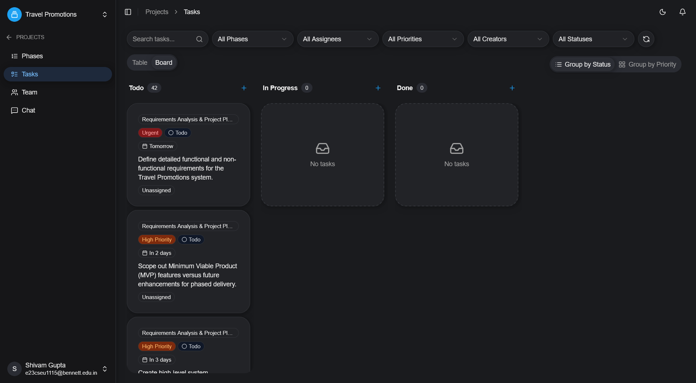
</details>

### Collaboration

<details open>
<summary><strong>Team</strong></summary>
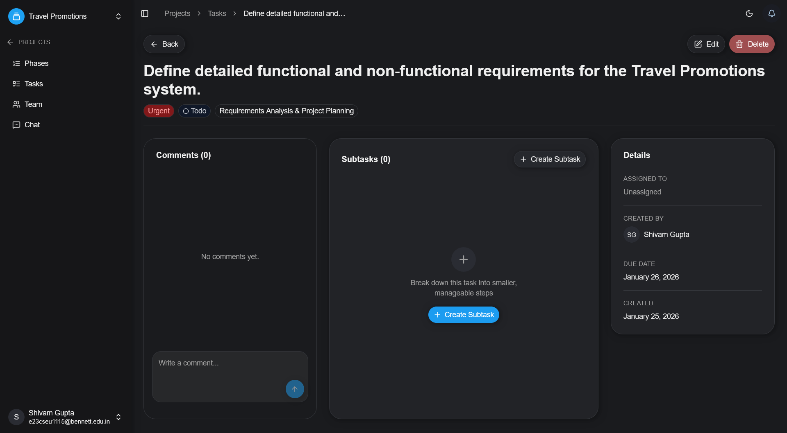
</details>

<details open>
<summary><strong>Chat</strong></summary>
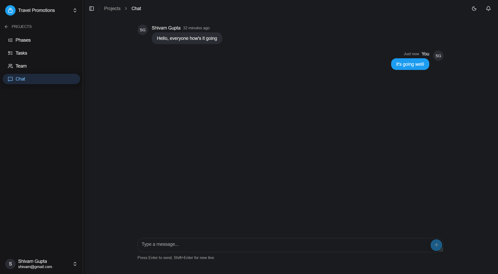
</details>

<details open>
<summary><strong>Notifications</strong></summary>
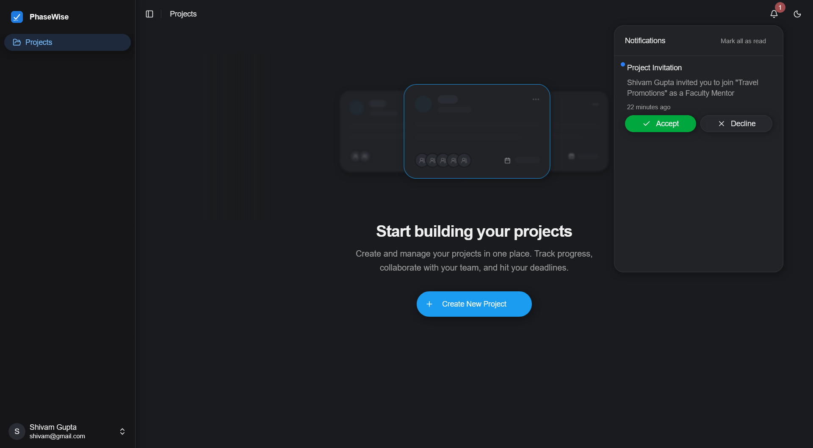
</details>

📌 Screenshots are stored in the `/screenshots` folder at the root.

---

## 🚀 Features

- **AI-Powered Phase Generation** – Automatically generate project phases and tasks using Google Gemini AI based on SDLC best practices
- **Role-Based Access Control** – Distinct roles for Students and Faculty with permission-based actions
- **Phase-Based Project Organization** – Structure projects into ordered phases with deadlines and progress tracking
- **Kanban & Table Task Views** – Manage tasks with drag-and-drop Kanban board or sortable table view
- **Real-Time Team Chat** – Project-level chat for team collaboration with polling-based updates
- **Project Invitations & Notifications** – Invite team members with email notifications and in-app notification system
- **Microsoft Entra ID Integration** – Enterprise SSO authentication alongside credentials-based login

---

## 🧠 What It Does

PhaseWise helps academic teams (students and faculty) plan, track, and collaborate on projects. Users create projects with defined phases (following SDLC methodology), assign tasks to team members, track progress with visual indicators, and communicate through integrated team chat. The AI assistant can generate an entire project plan with phases and tasks from just a title and description.

---

## 🛠️ Tech Stack

- **Frontend:** Next.js 15, React 19, Tailwind CSS, Radix UI, Shadcn/ui, Motion (Framer Motion)
- **Backend:** Next.js Server Actions, Next.js API Routes
- **Database:** MongoDB with Mongoose ODM
- **Auth:** NextAuth.js v5 (Auth.js) with MongoDB Adapter, Microsoft Entra ID, Credentials Provider
- **AI:** Google Generative AI (Gemini 2.5 Flash)
- **State Management:** Zustand, React Hook Form, TanStack Table
- **Email:** Resend for transactional emails
- **Drag & Drop:** dnd-kit for Kanban board and phase reordering
- **Validation:** Zod for schema validation
- **Deployment:** Vercel

---

## ⚙️ Setup

```bash
# Clone the repository
git clone https://github.com/yourusername/phasewise.git
cd phasewise

# Install dependencies
npm install

# Set up environment variables
cp .env.example .env.local
# Fill in your environment variables (see below)

# Run the development server
npm run dev
```

### Environment Variables

Create a `.env.local` file with the following:

```env
# Database
MONGODB_URI=your_mongodb_connection_string
DB_NAME=phasewise

# NextAuth
AUTH_SECRET=your_auth_secret
NEXTAUTH_URL=http://localhost:3000

# Microsoft Entra ID (Azure AD)
AUTH_MICROSOFT_ENTRA_ID_ID=your_client_id
AUTH_MICROSOFT_ENTRA_ID_SECRET=your_client_secret
AUTH_MICROSOFT_ENTRA_ID_ISSUER=https://login.microsoftonline.com/your_tenant_id/v2.0

# Google Gemini AI
GEMINI_API_KEY=your_gemini_api_key

# Resend Email
RESEND_API_KEY=your_resend_api_key

# App URL
NEXT_PUBLIC_APP_URL=http://localhost:3000
```

---

## 📁 Project Structure

```
src/
├── actions/          # Server actions for data mutations
├── app/              # Next.js App Router pages
│   ├── (auth)/       # Authentication pages (login, signup)
│   ├── (dashboard)/  # Protected dashboard routes
│   └── api/          # API routes
├── components/       # React components
│   ├── auth/         # Authentication forms
│   ├── chat/         # Team chat components
│   ├── phase/        # Phase management components
│   ├── project/      # Project components
│   ├── task/         # Task management components
│   ├── team/         # Team management components
│   └── ui/           # Shadcn/ui components
├── db/               # Database query functions
├── lib/              # Utility functions and helpers
├── models/           # Mongoose models
├── schemas/          # Zod validation schemas
├── stores/           # Zustand state stores
└── types/            # TypeScript type definitions
```

---

## License

MIT License
